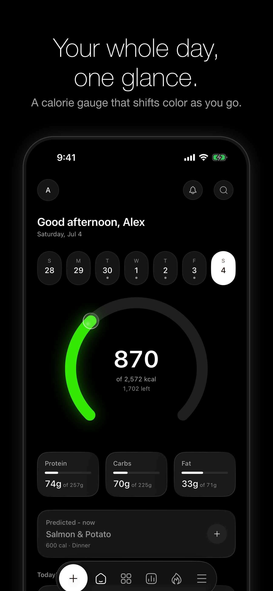
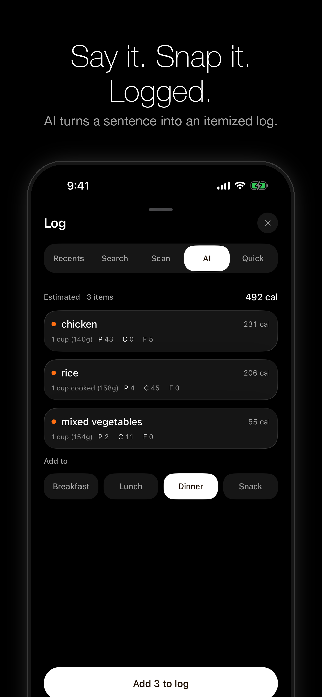
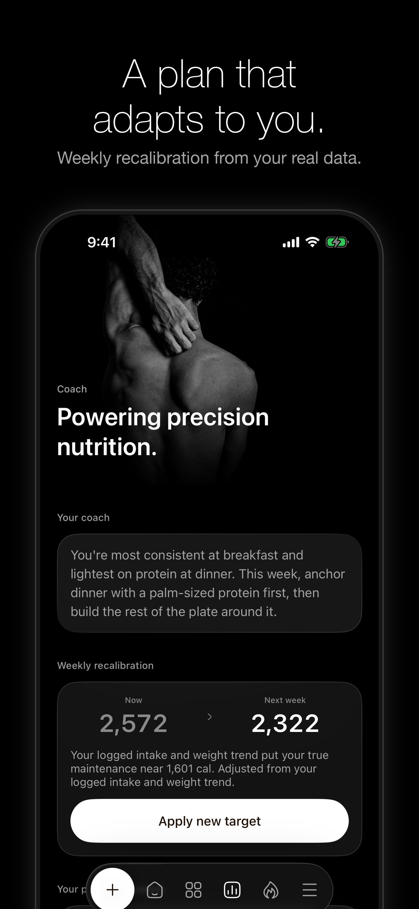
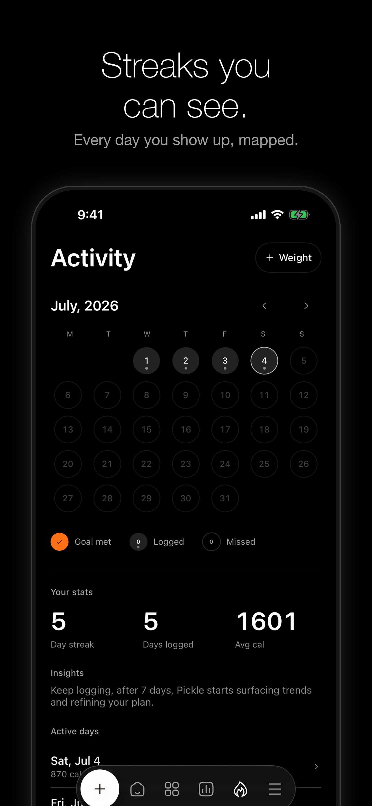

# PICKLE

A native iOS calorie and macro tracker built for the fastest possible log. The
category's real killer is logging friction, not motivation.

**[Live on the App Store](https://apps.apple.com/us/app/pickle-nutrition-tracker/id6787516850)**
· iPhone only, iOS 26 · local-first, no account

| Home | AI logging | Explore |
|:---:|:---:|:---:|
|  |  |  |
| **Coach** | **Activity** | |
|  |  | |

SwiftUI, true-OLED-black with white and gray chrome. Color is earned rather than
painted: a progressive Whoop-graded calorie gauge (white, then green, yellow,
orange, and red only when you are over), natural-color food photography, and one
warm accent reserved for goal moments.

## What it does

- **Home** - greeting header with reminders bell, a navigable week strip (tap a day;
  logging on a past day backfills to that day), a 270-degree progressive calorie
  gauge with a glass lens knob, monochrome macro cards, a **Predicted meal** card
  (local heuristic: your usual next meal, one tap to log), today's meals, quick links.
- **Log** (5 ways, from any tab via the floating bar) - Recents (one-tap re-log),
  Search (Open Food Facts plus a bundled ~80-item common-foods set), barcode Scan
  (VisionKit), AI photo and text estimate, and Quick add (raw kcal/P/C/F).
- **Meal reminders** - real local notifications with generic lock-screen copy (never
  food names), per-meal times, auto-skip for meals you already logged, tap opens the
  Log sheet on that meal.
- **Explore** - curated, one-tap-loggable **recipes** (natural-color photography)
  and categories.
- **Coach** - an adaptive weekly target (a poor-man's MacroFactor from logged intake
  plus weight trend), plan transparency, and a card that reads your patterns.
- **Activity** - month calendar with day-states, streak, stats, per-day detail.
- **More** - Goals & Plan, Apple Health, Favorites, Custom Foods, Loved Meals,
  Export (CSV/JSON), About (with a DEBUG median seconds-to-log readout: the
  north-star metric, measured).
- **WidgetKit** - lock and home-screen calorie arcs with the same progressive ramp,
  macros widget, shared App Group snapshot.

## Stack

- SwiftUI + **SwiftData** (`@Model`, local-first; CloudKit-compatible, sync currently off).
- **XcodeGen** generates `Pickle.xcodeproj` from `project.yml` (the `.xcodeproj` is gitignored).
- Design system: single token funnel (`Shared/PaletteValues.swift` feeds app `Palette`
  and widget `W`, so drift is a compile error), SF Pro with Dynamic Type preserved via
  UIFontMetrics scaling, Liquid Glass cards/bar (iOS 26), WCAG contrast gates enforced
  by unit tests.
- Icons: Hugeicons (stroke-rounded) as template PDFs, plus a few Lucide glyphs.
- **iOS 26** deployment target. Targets: `Pickle` (app), `PickleWidgetExtension`,
  `PickleTests`, `PickleUITests`. Shared snapshot and palette code in `Shared/`. AI
  proxy Worker in `proxy/`.

## Build & run

No API key is needed to build. AI logging goes through the deployed Worker, so the
example config covers everything else.

```bash
cp Config/Secrets.example.xcconfig Config/Secrets.xcconfig
xcodegen generate
```

Pick a simulator and run the suite against it by id. Matching on name alone is
ambiguous if you have more than one iPhone 17 Pro installed:

```bash
xcrun simctl list devices available | grep 'iPhone 17 Pro'

xcodebuild -project Pickle.xcodeproj -scheme Pickle \
  -destination 'platform=iOS Simulator,id=PUT-A-UDID-HERE' \
  -derivedDataPath /tmp/pickle-dd \
  CODE_SIGNING_ALLOWED=NO CODE_SIGNING_REQUIRED=NO test
```

DEBUG launch args for the screenshot loop: `--seed`, `--seed-empty`, `--seed-over`,
`--reset`, `--tab N`, `--open log|ai|quick|detail|widgets|more-<route>`.

## Tests

125 unit tests, green: store logic, prediction engine, reminder scheduling, week
math, and the WCAG contrast and ramp gates. Plus UI tests for More-tab routing and
horizontal-pan regressions. No third-party dependencies in any target.

## Notes and tradeoffs

**The AI key never ships in the binary.** The first version put the Anthropic key in
`Info.plist`, which anyone can pull out of a build with `unzip` and `plutil`. It now
exists only as a Cloudflare Worker secret and the app calls `/estimate`. That
relocates the trust boundary to the server, where the next step is App Attest so the
endpoint only answers real installs.

**The model is not trusted.** `parseItems` in the Worker pulls the first JSON object
out of the response and clamps every field before the app ever sees it: at most six
items, calories to 0-4000, macros to 0-1000, confidence to 0-1. The app then applies
its own sanity gate on top. Two independent checks, because a tracker that
occasionally logs 40,000 calories is worse than one that occasionally logs nothing.

**Sync is designed but off.** The SwiftData models are CloudKit-legal and
`AppConfig.useCloudKit` is `false`. The merge logic is unit-tested against simulated
histories rather than two real devices, and those tests prove the merge function, not
the sync. Turning it on is a device-verification job, not a code one, so it stays off
until that happens.

## Privacy

Diary and health data stay on device (and in your iCloud once sync is on).
Notifications never show food names on the lock screen. The one exception to
on-device: AI logging sends the described or photographed meal to the AI service to
estimate macros, then discards it. `Config/Secrets.xcconfig` and the reference frames
are gitignored.
