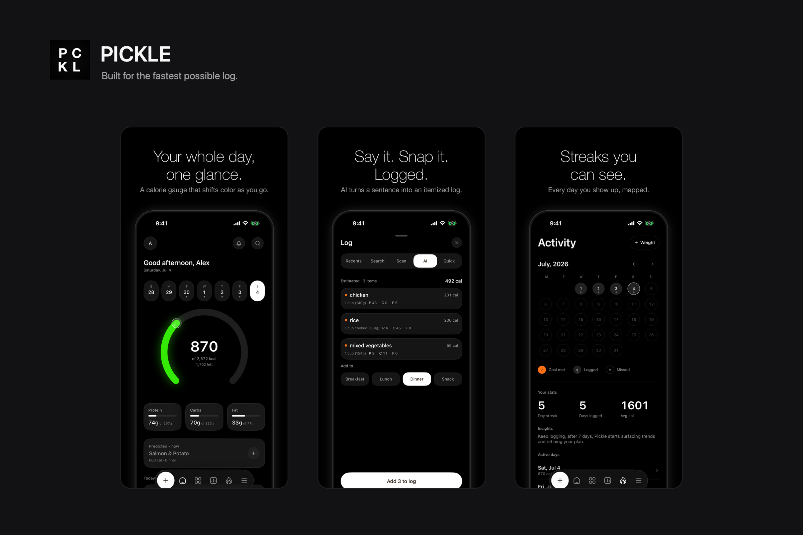
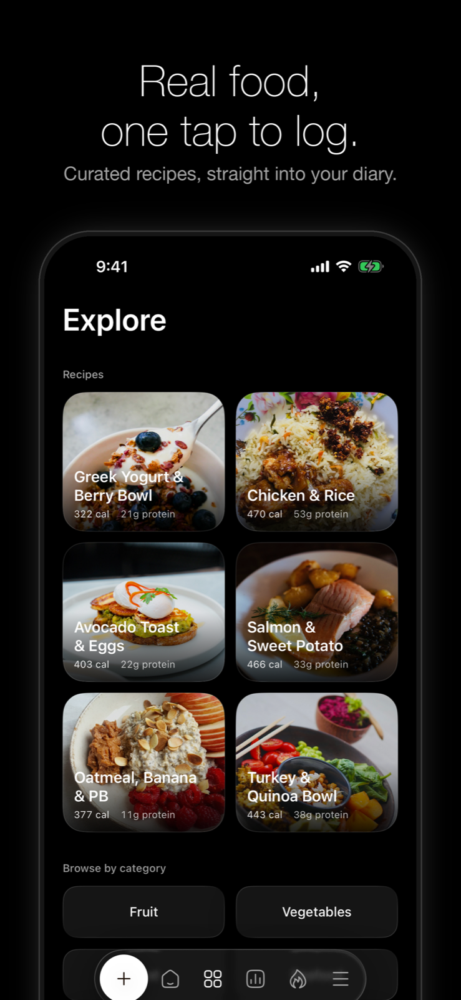

<p align="center">
  
</p>

<h1 align="center">PICKLE</h1>

<p align="center">
  A native iOS calorie and macro tracker built for the fastest possible log. Most people quit a tracker in the twenty seconds between deciding to log lunch and having logged it.
</p>

<p align="center">
  
</p>

<p align="center">
  <a href="https://apps.apple.com/us/app/pickle-nutrition-tracker/id6787516850"></a>
</p>

<p align="center">
  <sub>Free on the App Store. iPhone, iOS 26. Local first, no account.</sub>
</p>

Every calorie tracker is a search box over a database, and they mostly differ in
how long they make you wait. Pickle is built around that number: there is a
DEBUG readout in About showing the median seconds to log, which is the only way
to tell whether a change to the log flow actually helped or just felt faster.

There are five ways to log, all reachable from the floating bar on any tab.
Recents re-logs something in one tap. Search covers Open Food Facts plus a
bundled set of about eighty common foods. Scan reads a barcode through
VisionKit. AI takes a photo or a sentence and itemises it. Quick add takes raw
numbers when you already know them.

The home screen is a week strip you can tap back through, a 270 degree calorie
gauge with a glass lens knob, monochrome macro cards, and a Predicted meal card
that offers your usual next meal for one tap. Logging on a past day backfills to
that day rather than today.

Colour is earned rather than painted. The gauge runs white, then green, yellow,
orange, and red only once you are over, so a glance tells you where you are
without reading a number.

<p align="center">
  
</p>

Explore is curated recipes you can log in one tap, photographed in natural
colour rather than styled.

<p align="center">
  
</p>

Coach sets a weekly target from what you logged and how your weight moved,
rather than from a formula fixed at signup, and shows the plan it is working
from instead of asking you to trust it.

Meal reminders are real local notifications with generic copy on the lock
screen, never food names. They skip a meal you already logged, and tapping one
opens the log sheet on that meal. Activity is a month calendar with day states,
a streak and per-day detail. Lock screen and home screen widgets carry the same
progressive gauge, fed by a shared App Group snapshot.

## Build it yourself

No API key is needed to build. AI logging goes through a deployed Cloudflare
Worker, so the example config covers everything else.

```sh
cp Config/Secrets.example.xcconfig Config/Secrets.xcconfig
xcodegen generate
```

`Pickle.xcodeproj` is generated and gitignored, so a fresh clone has nothing to
open until that second line has run.

Pick a simulator by id rather than by name, because matching on name alone is
ambiguous once you have more than one iPhone 17 Pro installed:

```sh
xcrun simctl list devices available | grep 'iPhone 17 Pro'

xcodebuild -project Pickle.xcodeproj -scheme Pickle \
  -destination 'platform=iOS Simulator,id=PUT-A-UDID-HERE' \
  -derivedDataPath /tmp/pickle-dd \
  CODE_SIGNING_ALLOWED=NO CODE_SIGNING_REQUIRED=NO test
```

125 unit tests: store logic, the prediction engine, reminder scheduling, week
maths, and the WCAG contrast and ramp gates. Plus UI tests for More tab routing
and horizontal pan regressions. No third party dependencies in any target.

`Tools/Screenshots/ArticleImages.swift` regenerates the images on this page from
the App Store frames in `docs/screenshots`, which it leaves alone.

For the screenshot loop there are DEBUG launch arguments: `--seed`,
`--seed-empty`, `--seed-over`, `--reset`, `--tab N`, and
`--open log|ai|quick|detail|widgets|more-<route>`.

## Two things worth knowing

**The AI key never ships in the binary.** The first version put the Anthropic
key in `Info.plist`, which anyone can pull out of a build with `unzip` and
`plutil`. It now exists only as a Cloudflare Worker secret and the app calls
`/estimate`. That moves the trust boundary to the server, where the next step is
App Attest so the endpoint only answers real installs.

**The model is not trusted.** `parseItems` in the Worker pulls the first JSON
object out of the response and clamps every field before the app sees it: six
items at most, calories to 0 through 4000, macros to 0 through 1000, confidence
to 0 through 1. The app then applies its own sanity gate on top. Two independent
checks, because a tracker that occasionally logs 40,000 calories is worse than
one that occasionally logs nothing.

Sync is designed and off. The SwiftData models are CloudKit legal and
`AppConfig.useCloudKit` is `false`. The merge logic is unit tested against
simulated histories rather than two real devices, and those tests prove the
merge function rather than the sync, so it stays off until somebody verifies it
on hardware.

## Privacy

Diary and health data stay on the device, and in your iCloud once sync is on.
Notifications never show food names on the lock screen. The one thing that
leaves: AI logging sends the described or photographed meal to the service that
estimates its macros, which then discards it. `Config/Secrets.xcconfig` and the
reference frames are gitignored.

## Credit

Built by [Angel Vega](https://github.com/advegaf).

Icons are [Hugeicons](https://hugeicons.com) in stroke rounded, as template
PDFs, with a few Lucide glyphs.

## Licence

MIT. See [LICENSE](LICENSE).
